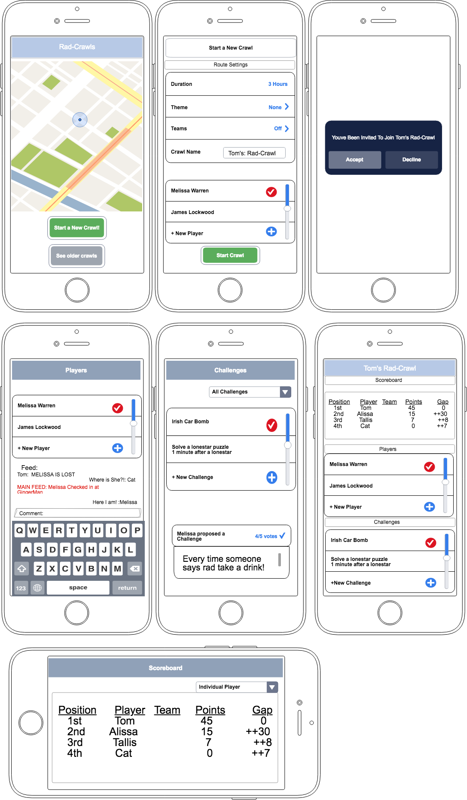

# Rad-Crawls

# User Stories
* A party leader should be able to engage a crawl at anytime.
	* The crawl should be editable and be mapped and routed nearby the users current location.
* A party leader should be able to invite friends to the party
* Along the route there should be challenges at different bars
	* These challenges could be something simple like an Irish car bomb at a bar tagged Irish, or something specific to the area or bar.
	* Users and bars owners should be able to create their own challenges.
	* Users can play solo or split into teams, accomplishing challenges along the way will increase your score.
* A user should be able to easily keep track of how many drinks they have had.
* A user should have access to other party members contact info
* A user should be able to check in to each spot along
	* A user should always be able to find the location of the party leader
* A user should be able to easily find a bathroom?
* A user should be reminded every hour of the game to drink a glass of water
* A party leader should be able to end the party at any time, and any player should be permitted to leave early.
* Users should be able to theme their crawls (ie St Pattys day)
* A user should be able to call out an opposing player for a head to head challenge
	* this should be limited
* A user should have an account
* Any user can become a party leader and invite another user at any point of the crawl
* The scoreboard should keep track of both user scores and team scores
* The game feed should allow users to post photos along the way

